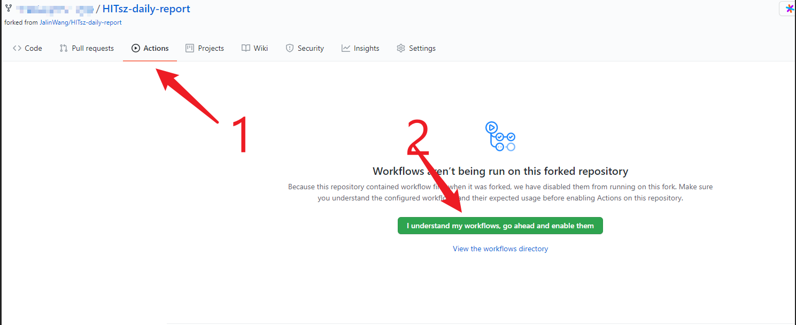
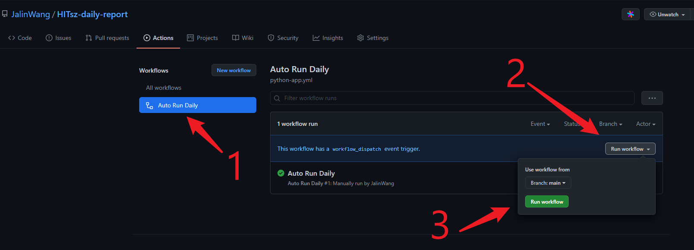

# HITsz-daily-report

基于Github Action的定时HITsz疫情上报脚本，开箱即用
感谢 @JellyBeanXiewh 提供原始脚本和idea。

[疫情上报系统入口](http://xgsm.hitsz.edu.cn/zhxy-xgzs/xg_mobile/xs/yqxx)

## 使用方法：
- fork仓库
- 设置仓库的action secret，添加用户名username、密码password和可选的API_KEY（详细步骤见后文）
- 开启Action（详细步骤见后文）
- 每天早上7:00（UTC 23:00)可自动定时运行，如果填写API_KEY，即可在微信上收到运行结果推送

消息推送Key申请地址：[Server酱](http://sc.ftqq.com/)

设置仓库的action secret，添加用户名username、密码password和可选的API_KEY：

| Name          | Value                                |
| ------------- | ------------------------------------ |
| username      | HITsz统一身份认证密码 （学号）         |
| password      | HITsz统一身份认证密码                 |
| API_KEY       | server酱推送的sckey                   |

据说fork的仓库会默认关闭action的执行，需要在仓库设置里打开：

以上步骤都完工后可以手动运行一次工作流，验证是否可以正常工作
